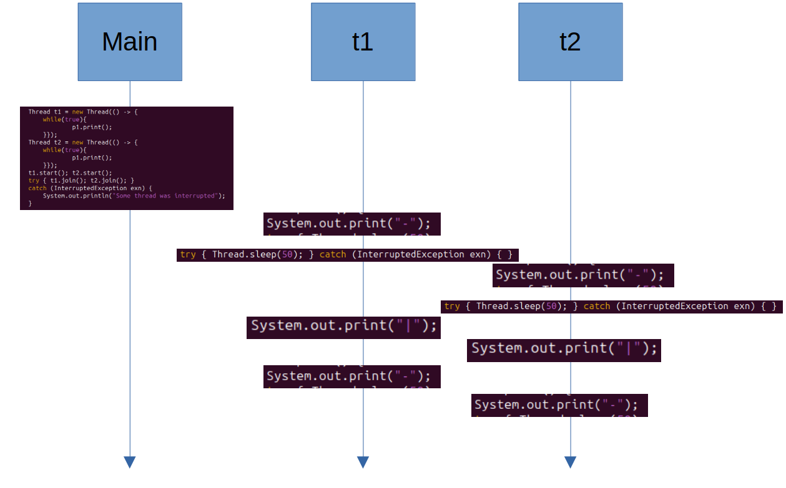

## 1.1 

### 1.1.1

We do not get the expected output of 20 million, but instead 19705913 because of race condition

### 1.1.2

It is not garuanteed to be 200. But much less likely to print another number.

### 1.1.3

These alternate options has more room for error because they use two steps to do the same. However java compiles it to be the same so there is no difference in testing.

### 1.1.4

A lock prevents the race condition from earlier meaning that only process has access to the variable at a time (critical section). This means that they will never try to increment the same number.

### 1.1.5

Yes, the critical section and lock only contains the shared variable. This is the least possible.

## 1.2 

### 1.2.2
One of the threads are sleeping while the other is printing. Therefore the double dash can occur.

 

### 1.2.3
It is correct since the entire pattern is inside the critical locked section. However it is super inefficient and equals to having one process. 

## 1.3

### 1.3.1

### 1.3.2

The critcal section of the if statement and increment is locked and therefore we ensure that the number of people will never be above 15000.

## 1.4

### 1.4.1

An example of something fitting the concurrency note and not the Goetz definitions is a gps. You need a lot of processes running at the same time, such as the gps, touchscreen input and route guidance.

An example of hidden but not fairness are VM's. Each vm feels like it has it own resources, however the resources are not equally shared among tenants and thus contradicting with fairness.

### 1.4.2

**Inherent**
Programming a robot. It must be able to have many parallel tasks running simultaneously to function properly.

**Exploitation**
Image loading. Loading multiple parts of the image concurrently to speed up the process for a more enjoyably experience. 
Random forest algorithm. Make the trees independently from each other and speed up the process.
